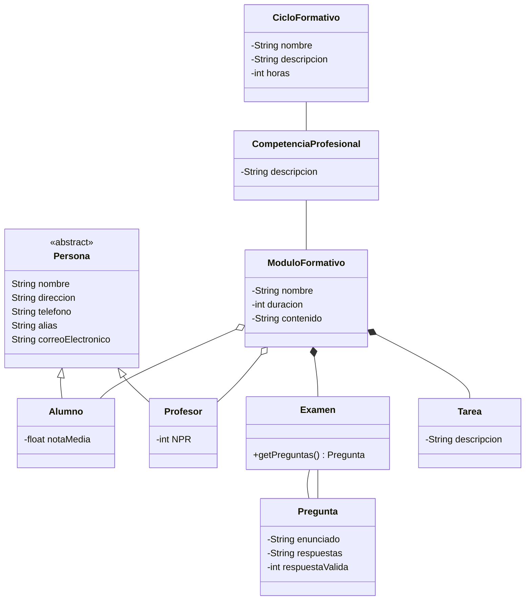

```mermaid
classDiagram
  

    class Persona{
    <<abstract>>
    String nombre
    String direccion
    String telefono
    String alias
    String correoElectronico
   


    }

    class Alumno{
    -float notaMedia
    }
    
    
    class Profesor{
    -int NPR
    }
    
   


    class CicloFormativo{
   -String nombre
   -String descripcion
   -int horas
  
    }

    class CompetenciaProfesional{
    -String descripcion
    
   

    }

    class Examen{
    +getPreguntas()Pregunta
    }

    class ModuloFormativo{
    -String nombre
    -int duracion
    -String contenido
    
   
    }

    class Pregunta{
    -String enunciado
    -String respuestas
    -int respuestaValida
    
    }
    class Tarea{
    -String descripcion
    }


    Persona <|-- Alumno
    Persona <|-- Profesor
    CicloFormativo  --  CompetenciaProfesional
    CompetenciaProfesional -- ModuloFormativo
    Examen  --  Pregunta
    ModuloFormativo  o--  Alumno
    ModuloFormativo  o--  Profesor
    ModuloFormativo  *--  Examen
    ModuloFormativo  *--  Tarea
    Pregunta --  Examen

```