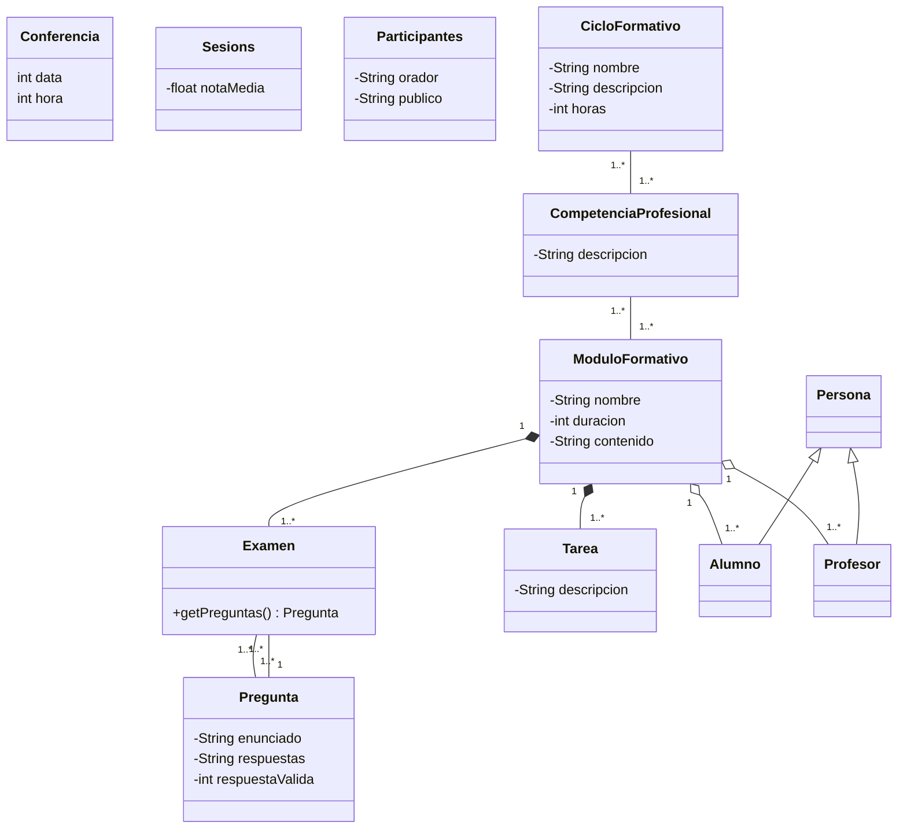

```mermaid
classDiagram
  

    class Conferencia{
    int data
    int hora

    }

    class Sesions{
    -float notaMedia
    }
    
    
    class Participantes{
    -String orador
    -String publico
    }
    
   


    class CicloFormativo{
   -String nombre
   -String descripcion
   -int horas
  
    }

    class CompetenciaProfesional{
    -String descripcion
    
   

    }

    class Examen{
    +getPreguntas()Pregunta
    }

    class ModuloFormativo{
    -String nombre
    -int duracion
    -String contenido
    
   
    }

    class Pregunta{
    -String enunciado
    -String respuestas
    -int respuestaValida
    
    }
    class Tarea{
    -String descripcion
    }


    Persona <|-- Alumno
    Persona <|-- Profesor
    CicloFormativo "1..*" -- "1..*" CompetenciaProfesional
    CompetenciaProfesional "1..*" -- "1..*" ModuloFormativo
    Examen "1..*" -- "1" Pregunta
    ModuloFormativo "1" o-- "1..*" Alumno
    ModuloFormativo "1" o-- "1..*" Profesor
    ModuloFormativo "1" *-- "1..*" Examen
    ModuloFormativo "1" *-- "1..*" Tarea
    Pregunta "1..*" -- "1..*" Examen

```