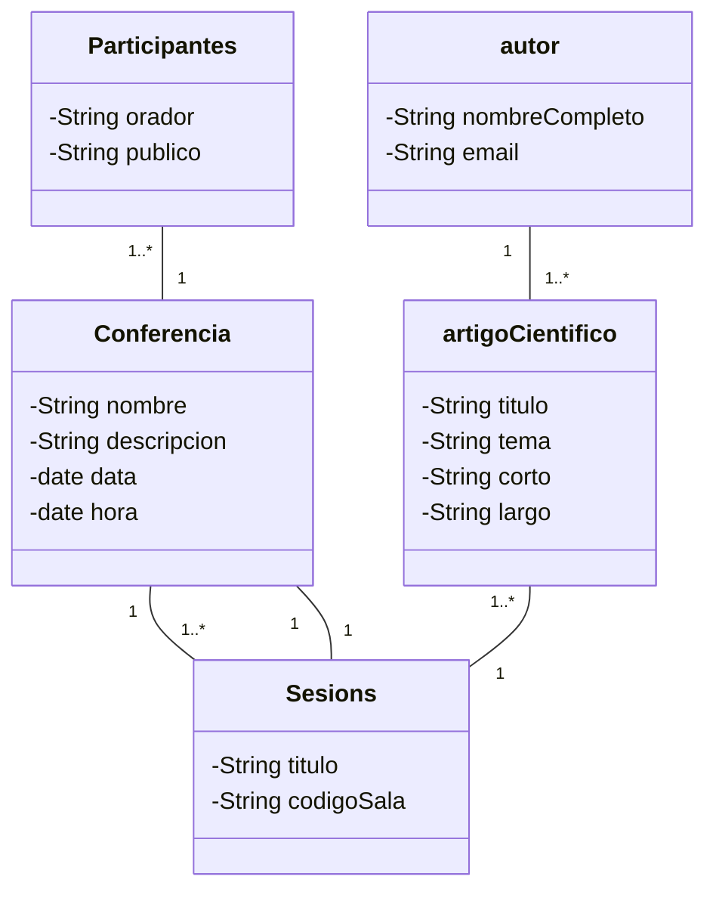

```mermaid
classDiagram
  

    class Conferencia{
    -String nombre
    -String descripcion
    -date data
    -date hora

    }

    class Sesions{
    -String titulo
    -String codigoSala
    }
    
    
    class Participantes{
    -String orador
    -String publico
    }
    
   


    class artigoCientifico{
   -String titulo
   -String tema
   -String corto
   -String largo
  
    }

    class autor{
    -String nombreCompleto
    -String email
    }

    


    Conferencia "1" --"1..*" Sesions
    Sesions "1"--"1" Conferencia
    Participantes "1..*" -- "1" Conferencia
    artigoCientifico "1..*"-- "1" Sesions
    autor "1"--"1..* " artigoCientifico

    
```