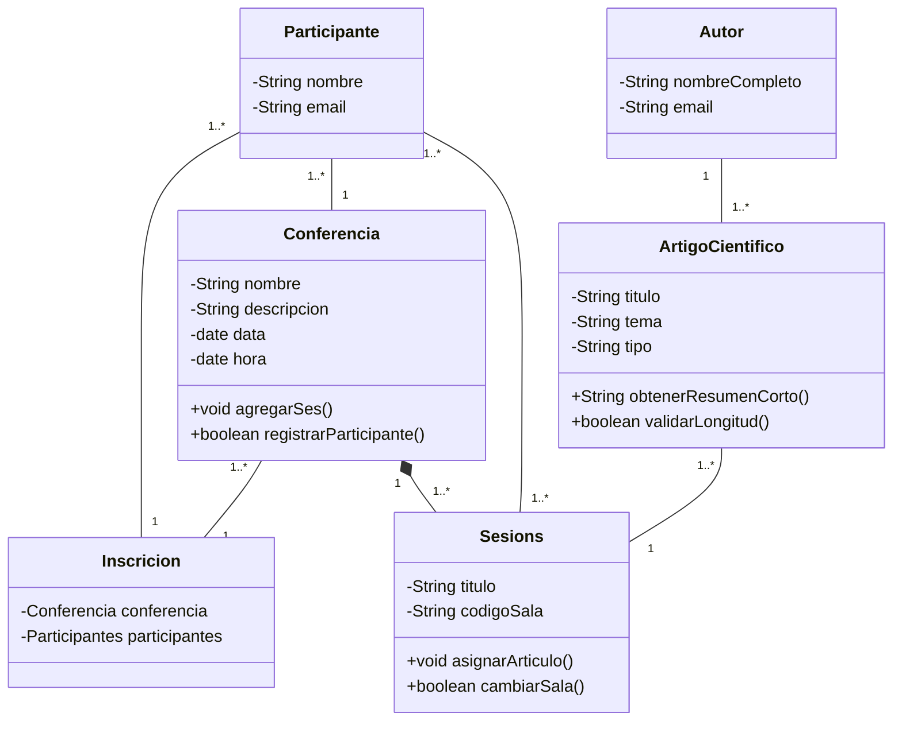

```mermaid
classDiagram
  

    class Conferencia{
    -String nombre
    -String descripcion
    -date data
    -date hora

    +void agregarSes() 
    +boolean registrarParticipante()

    }

    class Sesions{
    -String titulo
    -String codigoSala
    +void asignarArticulo()
    +boolean cambiarSala()
    }
    
    
    class Participante{
    -String nombre
    -String email
    }

    class Inscricion{
    -Conferencia conferencia
    -Participantes participantes
    }
    
   


    class ArtigoCientifico{
   -String titulo
   -String tema
   -String tipo
+String obtenerResumenCorto() 
+boolean validarLongitud() 
  
    }

    class Autor{
    -String nombreCompleto
    -String email
    }

    

Conferencia "1" *-- "1..*" Sesions
    
    Participante "1..*" -- "1" Inscricion
    Conferencia "1..*" -- "1" Inscricion
    Participante "1..*" -- "1" Conferencia
    Participante "1..*" -- "1..*" Sesions
    ArtigoCientifico "1..*" -- "1" Sesions
    Autor "1" -- "1..*" ArtigoCientifico

    
```