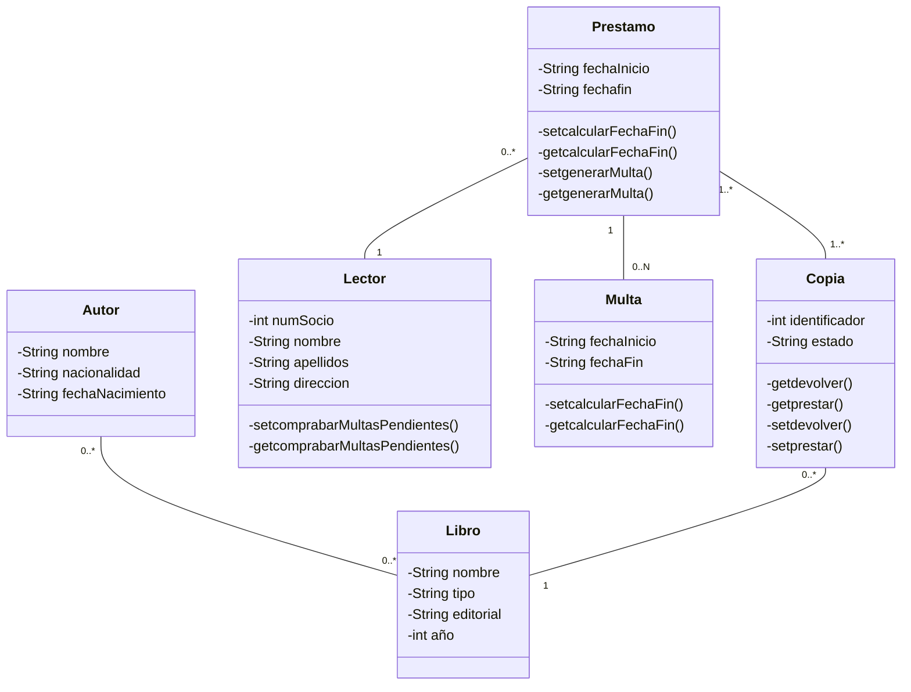

```mermaid
classDiagram

  

    class Autor{
    -String nombre
    -String nacionalidad
    -String fechaNacimiento
    }

    class Libro{
    -String nombre
    -String tipo
    -String editorial
    -int año
    }
    
    
    class Lector{
    -int numSocio
    -String nombre
    -String apellidos
    -String direccion
    -setcomprabarMultasPendientes()
    -getcomprabarMultasPendientes()

    }
    


    class Prestamo{
    -String fechaInicio
    -String fechafin
    -setcalcularFechaFin()
    -getcalcularFechaFin()
    -setgenerarMulta()
    -getgenerarMulta()
    }

    class Multa{
    -String fechaInicio
    -String fechaFin
    -setcalcularFechaFin()
    -getcalcularFechaFin()

    }

    class Copia{
    -int identificador
    -String estado
    -getdevolver()
    -getprestar()
    -setdevolver()
    -setprestar()
    }


    Prestamo"1..*"--"1..*"Copia
    Prestamo "1"--"0..N" Multa
    Prestamo "0..*"--"1"Lector
    Autor "0..*"-- "0..*" Libro 
    Copia "0..*"--"1 " Libro
   
```