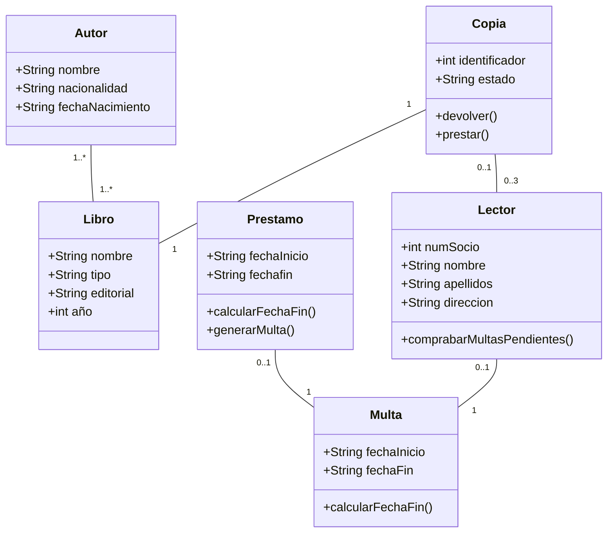

```mermaid
classDiagram
  

    class Autor{
    +String nombre
    +String nacionalidad
    +String fechaNacimiento
    }

    class Libro{
    +String nombre
    +String tipo
    +String editorial
    +int año
    }
    
    
    class Lector{
    +int numSocio
    +String nombre
    +String apellidos
    +String direccion
    +comprabarMultasPendientes()
    }
    


    class Prestamo{
    +String fechaInicio
    +String fechafin
    +calcularFechaFin()
    +generarMulta()
    }

    class Multa{
    +String fechaInicio
    +String fechaFin
    +calcularFechaFin()

    }

    class Copia{
    +int identificador
    +String estado
    +devolver()
    +prestar()
    }


    Copia "0..1" --"0..3" Lector 
    Prestamo "0..1"--"1" Multa
    Lector "0..1" -- "1" Multa
    Autor "1..*"-- "1..*" Libro 
    Copia "1"--"1 " Libro
```