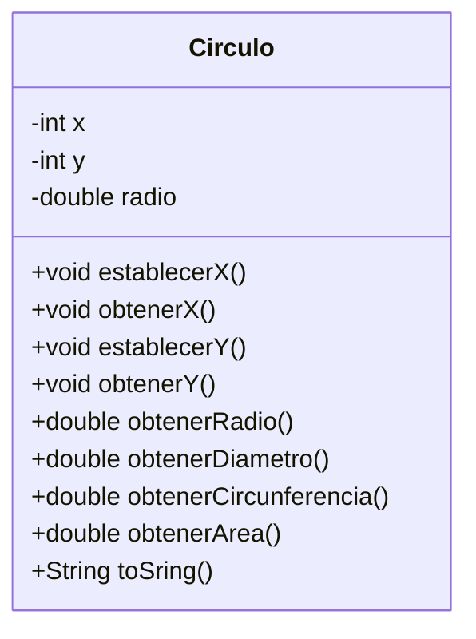

```mermaid
classDiagram

class Circulo{
-int x
-int y
-double radio
+void establecerX()
+void obtenerX()
+void establecerY()
+void obtenerY()
+double obtenerRadio()
+double obtenerDiametro()
+double obtenerCircunferencia()
+double obtenerArea()
+String toSring()
}
```